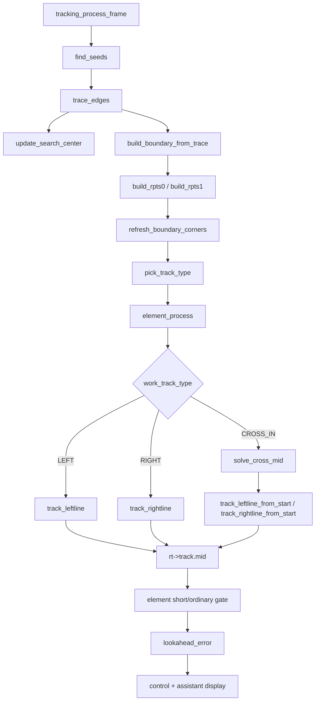
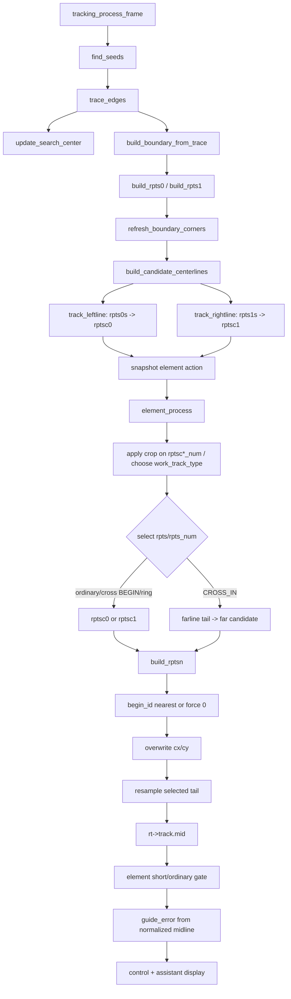
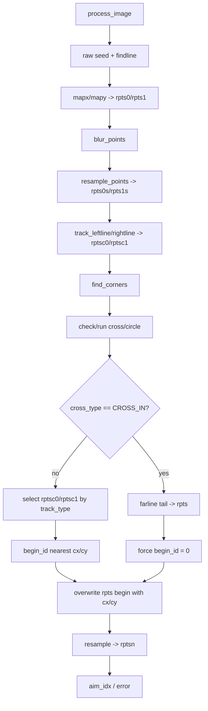

# Claude Review Flowchart

Updated: 2026-06-06.

Purpose: give Claude a compact but strict architecture review target before Stage 1 implementation.

This is not implementation approval. It is a review contract for a large tracking architecture change.

## What Claude Should Check

The planned Stage 1 is not a cosmetic rename. It changes the ownership of final control-midline generation.

Claude should review whether the proposed flow is internally consistent and whether it preserves current bug fixes that are not present in RT1064.

Review scope:

```text
code/tracking/imgproc.hpp
code/tracking/imgproc.cpp
code/tracking/mainline.cpp
```

Out of scope for Stage 1:

```text
seed acquisition behavior
ring state transitions
cross farline detection thresholds
control/PID
assistant protocol
file renames
runtime_t split
```

## Old Current Flow



Old problem:

```text
track_leftline/rightline currently do four jobs:
1. offset side boundary into a centerline candidate
2. find nearest begin to ref
3. overwrite begin with ref
4. resample and fill midline_t/dist[]

RT1064 only puts job 1 in track_leftline/rightline.
Jobs 2-4 belong to the selected centerline normalization stage.
```

## Target Stage 1 Flow



Target rule:

```text
Only build_rptsn() may create the final normalized control midline.
track_leftline/rightline must not write midline_t after Stage 1.
guide_error must never be computed from rptsc0/rptsc1 directly.
```

## RT1064 Reference Flow



Key reference anchors:

```text
RT1064 Project/USER/src/main.c:532-587
  process_image(): seed, trace, map, blur, resample, track_leftline/rightline -> rptsc0/rptsc1

RT1064 Project/USER/src/main.c:353-401
  select rpts/rpts_num, find begin_id, force begin_id for CROSS_IN, overwrite cx/cy, resample to rptsn

RT1064 Project/CODE/imgproc.c:611-635
  track_leftline/rightline only offset boundary to candidate centerline
```

## Stage 1 File Responsibilities

### `code/tracking/imgproc.hpp/.cpp`

Target public functions:

```cpp
int track_leftline(const double pts_in[POINT_MAX][2],
                   int num,
                   double pts_out[POINT_MAX][2],
                   int approx_num,
                   double dist);

int track_rightline(const double pts_in[POINT_MAX][2],
                    int num,
                    double pts_out[POINT_MAX][2],
                    int approx_num,
                    double dist);

int build_rptsn(const double rpts[POINT_MAX][2],
                int rpts_num,
                int cx,
                int cy,
                int force_begin_id0,
                midline_t *midline);
```

Rules:

```text
track_leftline/rightline:
  input: sampled side boundary
  output: candidate centerline points
  no ref/cx/cy
  no begin_id
  no midline_t
  no dist[]

build_rptsn:
  input: selected candidate centerline
  output: final midline_t
  owns begin_id, cx/cy overwrite, resample, dist[]
```

### `code/tracking/mainline.cpp`

Target file-local data contract:

```text
rpts0s/rpts1s     sampled side boundaries
rptsc0/rptsc1     candidate centerlines
rpts/rpts_num     selected candidate
rt->track.mid     final normalized control midline, equivalent to reference rptsn
```

Rules:

```text
ordinary/cross-BEGIN/ring select from rptsc0/rptsc1.
CROSS_IN builds a far candidate then calls build_rptsn(force_begin_id0=1).
zebra scan uses a normalized scan line produced through the same build_rptsn route.
```

## Preservation Gates

Claude should reject the Stage 1 plan or implementation if it breaks any gate below.

```text
G1. find_seeds() missing-side upward search stays unchanged.
G2. trace_edges() still clears failed sides before update_search_center().
G3. update_search_center() still runs after trace success, not immediately after seed search.
G4. width_base update remains normal-frame and accepted-pair limited.
G5. element short-midline gate remains: element frames allow >=3; ordinary frames stay strict.
G6. ring current-frame side/crop snapshot remains frame-start based.
G7. cross farline detection and far L thresholds stay unchanged.
G8. assistant red line remains rt->track.mid projected to raw.
G9. control/PID code is untouched.
G10. tracking_process_frame, ring, cross, zebra file/function names are not renamed in Stage 1.
```

## Specific Risk Points To Review

1. Candidate count consistency:
   - Stage 1 chooses RT1064-like candidate-first flow.
   - Build `rptsc0/rptsc1` once before `element_process()`.
   - Cross-near and ring-RUN crop must be applied to `rptsc0_num/rptsc1_num`.
   - Do not rely on old `rpts0s_num/rpts1s_num` crop as the effective control crop after candidates have already been built.

2. CROSS_IN:
   - `force_begin_id0` must replace `track_leftline_from_start/rightline_from_start`.
   - If all call sites are migrated, wrappers should be deleted; otherwise they must not be half-deleted.

3. Ring:
   - Stage 1 must preserve existing selected side/crop timing.
   - Do not make `ring_process()` output direct control midline.

4. Zebra:
   - `build_zebra_mid()` cannot keep calling old `track_leftline/rightline` semantics after those functions become candidate-only.
   - Its scan line must be normalized through `build_rptsn()`.

5. `cx/cy`:
   - Stage 1 names the variables `cx/cy` but keeps values equivalent to current `ref = {control_center_x, START_HIGH}`.
   - Do not switch to RT1064 `mapx/mapy 0.78H` origin in Stage 1.

6. `guide_error`:
   - must use `rt->track.mid` after `build_rptsn()`.
   - must not use `rptsc0/rptsc1` directly.

## Claude Review Prompt

```text
请只做架构审查，不改代码。仓库路径：
/mnt/e/longxin/ls2k0300_library/ls2k300_library/seekfree_ls2k0300_opensource_library/test_project/front_car_mainline

请阅读：
.trellis/tasks/06-06-align-midline-pipeline-to-autop/research/claude-review-flowchart.md
.trellis/tasks/06-06-align-midline-pipeline-to-autop/research/claude-review-resolution.md
.trellis/tasks/06-06-align-midline-pipeline-to-autop/research/all-stage-refactor-plan.md
.trellis/tasks/06-06-align-midline-pipeline-to-autop/research/non-reference-retention-plan.md
.trellis/tasks/06-06-align-midline-pipeline-to-autop/research/naming-and-file-boundary-plan.md

然后对 Stage 1 方案做审查：
1. 判断 `rpts0s/rpts1s -> rptsc0/rptsc1 -> selected rpts/rpts_num -> build_rptsn() -> rt->track.mid` 这条合同是否完整。
2. 检查是否有遗漏的调用点：track_leftline/rightline、track_leftline_from_start/rightline_from_start、build_zebra_mid、solve_cross_mid、普通/ring/cross 分支。
3. 检查是否破坏当前已推送的非参考修复：单侧 seed 补搜、trace 后 update_search_center/width_base、元素短线门、ring 帧首 action、assistant 红线。
4. 检查 Stage 1 是否不该触碰的东西：seed、ring 状态转移、cross farline detection、control/PID、assistant 协议、文件改名。
5. 输出结论：通过 / 不通过；如果不通过，按阻塞级别列出必须修改的方案点，并给出对应代码位置。

注意：不要实现，不要修改源码，只审查方案和风险。
```
