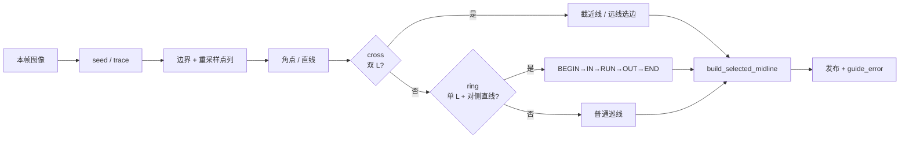
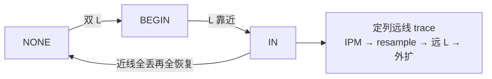
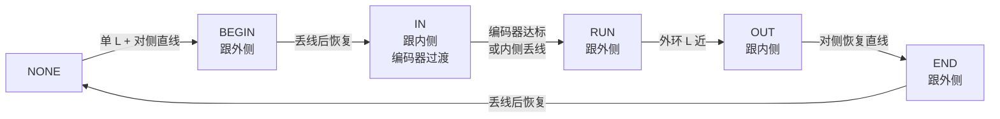
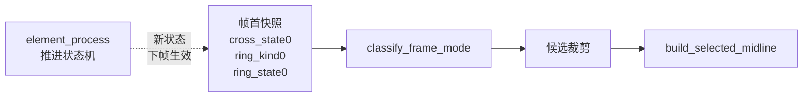

# 巡线主线备忘

日期：2026-06-10

## 图表索引

| 图 | 位置 | 表达 |
|----|------|------|
| 1. 链路 | 链路节 | 灰度图 → seed → 追线 → IPM → 平滑 → 重采样 → 外扩 → 元素选边 → 中线 → guide_error |
| 2. 元素状态机总览 | 元素总览节 | 本帧图像 → seed/trace → 边界/角点 → cross? → ring? → 普通 → build_selected_midline |
| 3. 十字状态机 | 十字节 | NONE → BEGIN → IN → NONE，附 IN 内部远线流程 |
| 4. 环岛状态机 | 环岛节 | NONE → BEGIN → IN → RUN → OUT → END → NONE，每个阶段标注跟内侧还是外侧 |
| 5. 帧首动作时序 | 帧首动作节 | 帧首快照 → classify → 裁剪 → 中线，element_process 新状态虚线箭头指向下一帧 |

## 链路


## 元素状态机总览



## 十字



十字分三段：

**1. NONE → BEGIN**

双 L（`l_pair_ok`，不是单侧 `l_ok`）进入十字。参考版 `cross.c` 用裸 `Lpt0_found && Lpt1_found`，当前多了宽度和张开二次检查。

**2. BEGIN**

先按 L 点截近线（`original_step` 和 `now_step` 都截到 `l_*_index`）。任一侧 L 点足够近（`l_now_index ≤ 4` 个重采样点）后切 `CROSS_IN`。参考版用物理距离 `0.1m` 判断，当前用重采样点计数，效果接近。

**3. IN**

每帧从左右固定列找远线 seed，再 trace、IPM、平滑、重采样、找远 L。远线 L 每帧重新 angle/NMS 计算；找不到时只允许旧 L 桥接 1 帧（`k_cross_far_l_reuse_max = 1`），第 2 帧释放。选边顺序：右远 L → 左远 L → 近线丢失侧。退出看两侧近线先全丢再全恢复。

参考版 `cross_farline()` 链条一致：`固定列 seed → trace → IPM → blur → resample → local_angle → NMS → 70°~110° conf`。主要差异点：

- **远线 seed 固定列**：参考版 `far_x1=86, far_x2=280`（376 宽）。当前按比例缩到 160 宽，约 `k_cross_far_left_x≈36, k_cross_far_right_x≈119`。若远线 seed 找不到，优先检查这两列在当前相机安装、IPM 表、曝光条件下是否仍落在有效赛道区域。
- **远线 seed 起始行**：参考版注释提到 `begin_y` 可渐变靠近防丢线，但 `cross_farline()` 代码中实际用的是全局 `begin_y`。当前从固定行 `k_cross_far_begin_y` 向下扫。二者是否完全等价，取决于参考版 `begin_y` 在其他位置的写入点。
- **重采样步长**：参考版用 `sample_dist * pixel_per_meter`（物理距离换算），当前用固定 `k_cross_far_resample_dist = 3px`。IPM 缩放比例不同时步长可能不对应。

### 十字不稳时怎么排查

| 字段 | 正常值 | 异常说明 |
|------|--------|---------|
| `cross_mid_fail` | `0` | 1=不在 IN，3=没远线，4=起点不对，5=尾巴太短，6=外扩失败，7=构建失败 |
| `left/right_far_fail` | `0` | 1=没 seed，2=trace 失败，3=trace 太短，4=IPM 太短，5=重采样太短 |
| `left/right_far_l_source` | `1` 或 `2` | 0 说明这侧远线没找到 L，选边会跳过 |
| `selected_mid_ok` | ≥3 | 0 说明十字帧没发出控制中线 |

排查顺序：

- `mode_cross_far=0`：还没进入稳定 IN。看 `mode_cross_near` 和左右 `l_pair_ok`。
- `far_fail=1`：远线 seed 没找到。看固定列 ≈36/119 是否落在赛道有效区域，图像灰度和局部阈值是否正常。
- `far_fail=2/3`：trace 断或太短。看 `far_seed` 坐标和局部阈值。
- `far_fail=4/5`：IPM 或重采样后点数太短。看远线是否出 IPM 视野。
- `far_l_source=0`：远线有点但没筛出 L。看远线点列在 70°~110° 角度范围内是否有峰值。这是十字远线最脆弱的环节——固定列远线在 160 宽图上 trace 出的点列拐角可能不够锐，角度峰值偏出范围外。
- `cross_mid_fail=6/7`：远 L 后外扩失败或 `build_rptsn` 失败。看 `cross_mid_tail` / `cross_mid_cand`。
- 中线能发但 guide_error 跳：看 `control_ref` 是否落到 fallback；远线起点（`force_begin_id0=1`）和近线起点不同可能产生切换跳变。

## 环岛



- 阶段选边：
  - BEGIN / RUN / END → 跟外侧边线（左环走右边，右环走左边）
  - IN / OUT → 跟内侧边线
- RUN 阶段发现外环 L 先裁线，L 够近才切 OUT
- `ring_opp_*` 是 ring 内部补对侧边界的检测/诊断/显示，不是控制中线

**如果环岛不稳，先看**：`mode_ring_active`、`candidate_crop_side/index`、`ring_opp_build_result`、`selected_mid_ok`。补边 build=-1 说明 seed/trace 断了；build=1 但 selected_mid_ok=0 说明候选线本身不够

## 帧首动作合同

- `classify_frame_mode()` 只用帧首 `frame_action_t`（`cross_state0 / ring_kind0 / ring_state0`）做本帧决策
- `element_process()` 推进出的新状态留到下一帧生效
- ring 选边只来自帧首快照，不读 post-element 当前状态



**测试覆盖**：`element_deferred_mode_test` 锁住"新进元素不抢当前帧普通候选"

## 与 AuTop 参考版的差异

| 模块 | AuTop RT1064 | 当前实现 | 差异说明 |
|------|-------------|---------|---------|
| 图像尺寸 | 376×240 | 160×120 | 分辨率和摄像头不同，像素常数不能直接照搬 |
| 局部阈值 | 7×7 均值减 2~5 | 5×5 均值减 8 | 参数差异，算法合同一致 |
| 搜索中心 | `W/2` 固定 | 动态 `mid_position` | 当前实现有学习机制，发布成功后更新 |
| 环岛入口 | 单 L + 对侧 straight | 同 | 一致 |
| 环岛 RUN 裁剪 | `Lpt_found` + `rpts*s_num = Lpt_rpts*s_id` | `l_found` 裁剪候选 | 一致。多了 `l_ok` 用于近距离门，裁线和切 OUT 分开 |
| 环岛 IN 补线 | 无 | 有（纯检测/诊断/显示） | 当前额外做了对侧边界合成，但不进控制候选 |
| 帧首动作 | 循环内直接检查并运行 | frame_action_t 快照 + 延迟一帧 | 当前多了时序隔离，避免同帧推进污染决策 |
| 控制输出 | `pure_angle → servo_pid` | `guide_error → target_yaw → yaw_cmd` | 差速控制 vs 舵机，不能把 pure_angle 直接搬过来 |
| OTSU | PR #6 改为区域接口 | 已有 `region_otsu()` | 一致 |
| 重采样 | PR #6 `remain` 改浮点 | 已有 `double accumulated` | 一致 |

## 不要做的事

- 不要重写迷宫法
- 不要全图二值化
- 不要把 ring_opp 直接接进 rptsc
- 不要照搬 376x240 的像素常数
- 不要靠改 ROAD_HALF_WIDTH 或补线阈值掩盖 IPM 标定问题
- 如果 guide_error 稳定但车体扭，优先查差速控制，不是 tracking

## 以后可以做：控制补线

只有在实车或 replay 证明下面任一情况时才做：
- 元素态 selected_mid_ok 经常不足
- guide_error 在十字/环岛阶段跳变，且不是选边错误、不是候选线过短

落地时要：
- 新建明确的输出路径（如 solve_ring_mid），不能静默 fallback
- 不能复用旧中线
- 不能把 ring_opp_* 直接接进 rptsc
- 要有独立的诊断字段和测试

## Calvariaa PR #6 相关修复

RT1064 官方仓库已合并的三个关键修复，当前项目用测试锁住：

- 重采样不回到原点 → `midline_lookahead_test::run_resample_no_repeat_contract`
- 区域 OTSU 不被区域外污染 → `line_trace_contract_test::run_region_otsu_contract`
- 控制参考点查表保持 [raw_y][raw_x] → `search_center_learning_test::run_control_ref_ipm_index_contract`

## 相关测试

- `cross_farline_reuse_test`：远线 L NEW → REUSED → NONE
- `boundary_contract_test`：直线 / 单 L / 双 L
- `element_entry_contract_test`：cross/ring 入口语义
- `element_deferred_mode_test`：帧首动作延迟生效
- `ring_opp_diag_test`：ring 补边诊断写入
- `search_center_learning_test`：搜索中心学习 + 控制参考点
- `line_trace_contract_test`：seed/trace/下弯/区域 OTSU
- `midline_lookahead_test`：前瞻/重采样

## 验证

```bash
bash code/test.sh --host
bash code/test.sh
```

## 参考代码路径

- RT1064：`/mnt/e/longxin/RT1064_Code_ref/SJTU-AuTop-RT1064-Code/Project/CODE/cross.c`
- RT1064：`/mnt/e/longxin/RT1064_Code_ref/SJTU-AuTop-RT1064-Code/Project/CODE/circle.c`
- 当前：`code/tracking/{imgproc,perspective,boundary,cross,ring,mainline}.cpp`
