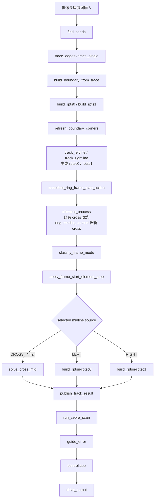

# tracking 流程图

这份文档只画当前 `front_car_mainline` 正在执行的 tracking 主链。历史迁移方案、强制状态入口和已废弃 owner 说法不写在这里。

## 1. 一帧总览



关键点：

- `rptsc0/rptsc1` 在 `element_process()` 之前已经生成。
- `ring_process()` 之后即使改了 `boundary_t`，当前帧也不会从改后的 `boundary_t` 重建 `rptsc0/rptsc1`。
- `cross_far` 是例外来源：`solve_cross_mid()` 从 `cross.left_pts/right_pts` 的远线候选生成当前帧中线。
- `zebra_process()` 只读 mainline 传入的 scan midline 和 raw 图像。

## 2. 模块 owner

```text
imgproc     seed / trace / 点列工具 / 候选外扩 / build_rptsn
boundary    boundary_t 点列解释、单侧 L、strict double-L、直线判定
cross       cross 状态、远线点列、cross.track_type
ring        ring 状态、检测/状态连续用边界补线和截线
element     cross/ring 互斥调度
mainline    当前帧 selected candidate -> rt->track.mid 的唯一 owner
zebra       scan midline + raw image -> zebra.detected / stop_line
report      runtime 诊断输出，不定义算法门槛
control     guide_error / stop_line / track_line_found -> duty
```

## 3. boundary.cpp 边界语义

`refresh_boundary_corners()` 的输出分三层，不允许混用：

```text
scan_corner()
-> l_found
   boundary 几何扫描见到单侧 L 候选

front consumer gate
-> l_ok
   单侧 L 候选落在可消费前段
   ring / zebra scan / ring RUN crop 可读

strict pair validation
-> l_pair_ok
   左右 L 通过 strict double-L 复核
   cross 入口唯一读取它
```

`l_found/l_ok` 都不是 cross 入口信号。双 L 复核失败不会清单侧 `l_ok`。

## 4. element.cpp 互斥调度

当前互斥顺序以代码为准：

```text
element_process(rt)
-> cross.state != NONE:
   -> cross_process(rt)
   -> cross.state 仍 != NONE: 清 ring，返回
-> ring pending second / false-wait / active:
   -> ring_process(rt)，返回
-> cross_process(rt)
   -> 新进 cross: 清 ring，返回
-> ring.kind != NONE:
   -> ring_process(rt)，返回
-> ring_process(rt)
   -> ring.kind != NONE: 返回
-> 无元素
```

含义：

- 已有 cross 优先；仍在 cross 时 ring 被清掉。
- ring pending second、false-wait 和已确认 ring 会挡新 cross 入口。
- ring pending first 仍允许新 cross，对齐参考版 `ring_times < 2`。
- ring 只在未被已有 cross 抢占时推进或检测入口。
- zebra 不在 `element_process()` 内；zebra scan 在 mainline 成功发布中线后运行。

## 5. cross.cpp 十字流程

十字入口只接受 strict double-L：

```text
cross_process(rt)
|
|-- NONE
|   |-- strict_double_l_ok(left, right)?
|       |-- yes -> BEGIN -> cross_begin()
|       |-- no  -> return
|
|-- BEGIN
|   |-- 用 l_pair_ok 对应的 L 点截近线
|   |-- both strict L && 至少一侧 L 靠近车前
|       |-- yes -> IN
|       |-- no  -> 留在 BEGIN
|
|-- IN
    |-- 每帧构建 left/right farline
    |-- 优先按有效远 L 选 cross.track_type
    |-- 远 L 不稳时按近线丢失侧选边
    |-- 近线先一起丢失多帧、再一起恢复后退出
```

当前没有 weak cross entry。需要 weak entry 时必须新建独立入口函数，不能把 `l_ok` 塞回 `strict_double_l_ok()`。

`cross.cpp` 不写 `rt->track.mid`。当前帧十字远线中线由 `mainline.cpp::solve_cross_mid()` 生成。

## 6. ring.cpp 环岛流程

环岛入口读单侧 `l_ok` 和对侧直线：

```text
ring_process(rt)
|
|-- NONE
|   |-- cross 活动：return
|   |-- left.l_ok && !right.l_ok && right straight -> LEFT BEGIN
|   |-- !left.l_ok && right.l_ok && left straight -> RIGHT BEGIN
|
|-- BEGIN
|   |-- 当前贴边 cur 先短、再恢复到 have 门 -> IN
|
|-- IN
|   |-- cur 很短或编码器距离到门 -> RUN
|   |-- 否则 build_ring_opp_for_detection() 补对侧检测边界
|       -> refresh_ring_corners()
|
|-- RUN
|   |-- 对侧 opp.l_ok 出现 -> 截 opp 检测边界并刷新角点
|   |-- opp L 靠前 -> OUT
|
|-- OUT
|   |-- opp 恢复直线 -> END
|
|-- END
    |-- cur 先短、再恢复到 have 门 -> reset
```

`build_ring_opp_for_detection()` 是 ring 内部检测/状态连续 helper。它可以改 `boundary_t`，但当前帧控制中线不从这条补线重建。

## 7. mainline.cpp 当前帧动作

`mainline.cpp` 的当前帧动作顺序：

```text
build_frame_boundaries_and_candidates()
  -> ordinary_track_type
  -> rptsc0/rptsc1

snapshot_ring_frame_start_action()
  -> ring_track_type
  -> ring_frame_start_crop_side/index

element_process()
  -> 推进 cross/ring 状态

classify_frame_mode()
  -> cross_far / cross_near / ring_active / ordinary

apply_frame_start_element_crop()
  -> cross_near: 按近线 now_step 裁 rptsc0/rptsc1
  -> ring RUN: 按帧首 ring_frame_start_crop_* 裁 rptsc0/rptsc1

build_selected_midline()
  -> cross_far: solve_cross_mid()
  -> LEFT: build_rptsn(rptsc0)
  -> RIGHT: build_rptsn(rptsc1)

publish_track_result()
  -> rt->track.mid / center_x / guide_error / track_type
```

这个顺序解决当前帧 owner：

- ring 可以推进状态，但不能把 post-state 或 post-boundary 隐式塞进当前帧控制候选。
- cross 只有在帧首已是 `CROSS_STATE_IN` 且帧尾仍是 `IN` 时才走 farline。
- 同帧 `BEGIN -> IN` 不立刻要求 farline。

## 8. zebra.cpp 斑马线流程

```text
run_zebra_scan()
-> build_zebra_scan_midline()
   -> left.l_ok only: 用 rptsc1 构造 scan_mid
   -> right.l_ok only: 用 rptsc0 构造 scan_mid
   -> 其它: scan_mid=null
-> zebra_process(rt, scan_mid)
   -> scan_mid != null: 扫中线两侧黑白段
   -> 始终检查 START_HIGH 底部黑线 stop_line
```

scan midline 不一定等于当前控制中线。zebra 不选择控制来源，也不写 `rt->track.mid`。

## 9. control.cpp 控制流程

`control.cpp` 从 tracking 发布结果开始，不重新判断图像和元素：

```text
track_line_found(rt)
guide_error
zebra.stop_line
-> target_yaw
-> yaw-rate feedback
-> wheel target rps
-> wheel PI
-> duty
```

tracking 失败时控制层只清状态并输出无效，不做视觉兜底。
