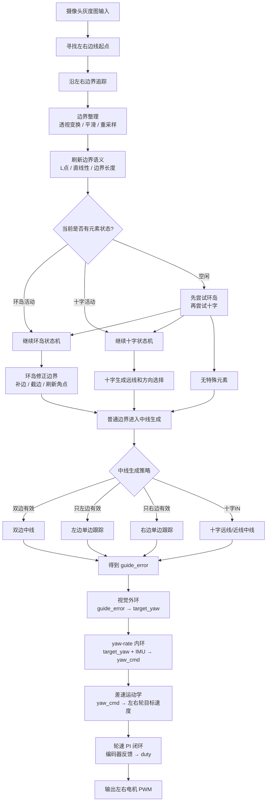

# tracking 流程图




这份文档只画当前 `front_car_mainline` 正在跑的 tracking 主链，以及当前已接入的两种主要元素：`cross` 和 `ring`。

原则：

- 这里只记录真实执行顺序，不记录已经退休的强制状态入口。
- `imgproc.cpp` 负责 seed、trace、点列处理和中线工具。
- `element.cpp` 负责元素互斥调度。
- `cross.cpp` 和 `ring.cpp` 只维护各自状态机，不直接输出电机 duty。

## 1. 从 imgproc.cpp 开始看的图像处理主链

`imgproc.cpp` 不是整帧入口，但它提供 tracking 主链里最底层的图像处理工具。按一帧的实际使用顺序，可以这样看：

```text
raw gray
|
|-- find_seeds()
|      |
|      |-- 在固定起线行，从中心两侧找左右白->黑边沿
|      |-- 写入 rt->seeds.left / rt->seeds.right / rt->seed_state
|
|-- trace_edges()                         // mainline.cpp 调用
|      |
|      |-- trace_single(gray, left seed,  left_side=1)
|      |-- trace_single(gray, right seed, left_side=0)
|      |-- 某侧 trace 失败时清掉该侧 seed 和 trace
|
|-- build_boundary_from_trace()            // boundary.cpp
|      |
|      |-- 原图 trace 点保存到 boundary.original_pts
|      |-- perspective_points()
|      |-- blur_points()
|      |-- resample_points()
|      |-- 写入 boundary.now_pts / now_step
|
|-- refresh_boundary_corners()             // boundary.cpp
|      |
|      |-- 在重采样后的左右边界上刷新 L 点、直线性等角点语义
|
|-- element_process()
|      |
|      |-- ring_process() / cross_process() 互斥推进
|
|-- build_rpts0() / build_rpts1()           // mainline.cpp
|      |
|      |-- 左右边界原图点
|      |-- perspective_points()
|      |-- blur_points()
|      |-- resample_points()
|
|-- 生成控制中线
       |
       |-- 双边有效：track_dualline()
       |-- 只左边有效：track_leftline()
       |-- 只右边有效：track_rightline()
       |-- 十字 IN：solve_cross_mid() 按 cross.track_type 选远线或近线
       |
       |-- 写入 rt->track.mid
       |-- 写入 center_x / guide_error
```

简化成一行：

```text
find_seeds
-> trace_single
-> build_boundary_from_trace
-> refresh_boundary_corners
-> element_process
-> perspective_points / blur_points / resample_points
-> track_dualline / track_leftline / track_rightline
-> guide_error
```

## 2. 元素互斥调度流程

元素入口是 `element_process(rt)`，内部只做互斥调度，不直接做中线和控制。

```text
element_process(rt)
|
|-- 当前 ring 已经活动？
|      |
|      |-- 是：ring_process(rt)，本帧不再尝试 cross
|      |-- 否：继续
|
|-- 当前 cross 已经活动？
|      |
|      |-- 是：cross_process(rt)，本帧不再尝试 ring
|      |-- 否：继续
|
|-- 空闲状态先尝试 ring_process(rt)
|      |
|      |-- ring 进入非 NONE：本帧结束
|      |-- ring 仍 NONE：继续
|
|-- 再尝试 cross_process(rt)
       |
       |-- cross 进入非 NONE：本帧结束
       |-- cross 仍 NONE：本帧没有元素
```

当前互斥顺序是：

```text
已有状态优先继续跑；空闲时先 ring，再 cross。
```

## 3. cross.cpp 十字流程图

十字入口依赖左右普通边线的双 L 点。进入十字后，BEGIN 阶段先截近线，IN 阶段再每帧重建远线。

```text
cross_process(rt)
|
|-- state == CROSS_STATE_NONE
|      |
|      |-- 左右普通边线都有 L 点？
|              |
|              |-- 是：state = CROSS_STATE_BEGIN
|              |       not_have_line = 0
|              |       cross_begin(rt)
|              |
|              |-- 否：什么都不做
|
|-- state == CROSS_STATE_BEGIN
|      |
|      |-- cross_begin(rt)
|              |
|              |-- 左边有 L 点：left original/now 截到 L 点
|              |-- 右边有 L 点：right original/now 截到 L 点
|              |
|              |-- 左右都有 L 点，并且至少一侧 L 点已经靠近车前方？
|                      |
|                      |-- 是：state = CROSS_STATE_IN
|                      |       not_have_line = 0
|                      |
|                      |-- 否：继续 BEGIN
|
|-- state == CROSS_STATE_IN
       |
       |-- cross_evolve(rt)
              |
              |-- 清空本帧 cross 远线结果
              |
              |-- 左固定列 find_far_seed()
              |       -> trace_single()
              |       -> perspective_points()
              |       -> blur_points()
              |       -> resample_points()
              |       -> far_l_index()
              |
              |-- 右固定列 find_far_seed()
              |       -> trace_single()
              |       -> perspective_points()
              |       -> blur_points()
              |       -> resample_points()
              |       -> far_l_index()
              |
              |-- 左右近线都短于 k_cross_near_lost_step？
              |       |
              |       |-- 是：not_have_line++
              |       |-- 否：不增加
              |
              |-- 选 cross.track_type
              |       |
              |       |-- 右远线构建成功、点数够、右远 L 有效：TRACK_TYPE_RIGHT
              |       |-- 否则左远线构建成功、点数够、左远 L 有效：TRACK_TYPE_LEFT
              |       |-- 否则如果近线已经丢过：
              |              |
              |              |-- 右近线短：TRACK_TYPE_RIGHT
              |              |-- 左近线短：TRACK_TYPE_LEFT
              |
              |-- 退出判断
                      |
                      |-- not_have_line > 2，并且左右近线都恢复到 k_cross_near_recover_step 以上？
                              |
                              |-- 是：cross_leave()，清空十字状态
                              |-- 否：继续留在 CROSS_STATE_IN
```

十字退出条件的真实含义：

```text
必须先看到左右近线一起丢失超过 2 帧，
再看到左右近线一起恢复，
才认为已经离开十字。
```

这样做是为了避免刚进入十字时，近线还没完全断开就误退出。

## 4. ring.cpp 环岛流程图

环岛入口依赖“一侧有 L 点、另一侧直”的组合。环岛状态顺序是：

```text
RING_STATE_BEGIN
-> RING_STATE_IN
-> RING_STATE_RUN
-> RING_STATE_OUT
-> RING_STATE_END
-> reset
```

完整流程：

```text
ring_process(rt)
|
|-- ring.kind == RING_KIND_NONE
|      |
|      |-- cross 当前正在活动？
|      |       |
|      |       |-- 是：直接 return，避免 ring/cross 同时活动
|      |       |-- 否：继续判断入口
|      |
|      |-- 左环入口？
|      |       |
|      |       |-- 左边有 L 点、右边没有 L 点、右边界直
|      |       |-- 是：kind = RING_KIND_LEFT
|      |
|      |-- 右环入口？
|              |
|              |-- 右边有 L 点、左边没有 L 点、左边界直
|              |-- 是：kind = RING_KIND_RIGHT
|
|-- 选择当前侧 cur 和对侧 opp
|      |
|      |-- 左环：cur = left， opp = right
|      |-- 右环：cur = right，opp = left
|
|-- state == RING_STATE_BEGIN
|      |
|      |-- cur->now_step < k_lost_step：lost_count++
|      |-- cur->now_step > k_have_step 且 lost_count 已确认：have_count++
|      |-- have_count 确认后：记录 encoder0，state = RING_STATE_IN
|
|-- state == RING_STATE_IN
|      |
|      |-- cur->now_step < k_in_lost_step 或编码器距离达到入环阈值？
|      |       |
|      |       |-- 是：state = RING_STATE_RUN
|      |       |-- 否：build_opp() 补对侧边界
|      |              -> refresh_ring_corners()
|
|-- state == RING_STATE_RUN
|      |
|      |-- 对侧 opp 出现 L 点？
|              |
|              |-- 是：把 opp 截到 L 点附近
|              |       sync_bd()
|              |       refresh_ring_corners()
|              |
|              |-- L 点足够靠前：state = RING_STATE_OUT
|
|-- state == RING_STATE_OUT
|      |
|      |-- opp 已经恢复为直线？
|              |
|              |-- 是：state = RING_STATE_END
|              |-- 否：继续 OUT
|
|-- state == RING_STATE_END
       |
       |-- cur->now_step < k_lost_step：lost_count++
       |-- cur->now_step > k_have_step 且 lost_count 达到左右环对应退出确认次数？
              |
              |-- 是：ring_reset()，清空环岛状态
              |-- 否：继续 END
```

环岛里几个关键辅助过程：

```text
build_opp()
-> 清空对侧 boundary
-> 从当前边界附近估计 seed
-> find_column_seed()
-> trace_single()
-> 直线补点接到 trace 尾段
-> sync_bd()

sync_bd()
-> original_pts
-> build_boundary_from_trace()
-> perspective_points / blur_points / resample_points

refresh_ring_corners()
-> 左右 original_pts
-> perspective_points
-> blur_points
-> resample_points
-> refresh_boundary_corners()
```

## 5. 两种元素对主线的影响位置

```text
普通边界已经生成
|
|-- element_process()
|      |
|      |-- ring_process()
|      |       |
|      |       |-- 可能补对侧边界
|      |       |-- 可能截断边界
|      |       |-- 刷新角点
|      |
|      |-- cross_process()
|              |
|              |-- BEGIN 可能截断左右近线
|              |-- IN 写入 cross.track_type 和 cross 远线点列
|
|-- mainline 后续中线生成
       |
       |-- ring 修改后的 boundary 会直接参与普通单边/双边中线
       |-- cross IN 时 solve_cross_mid() 优先使用 cross 远线 L 点后的远线
```

注意：

- `cross.cpp` 只决定十字状态、远线和 `track_type`，真正中线在 `mainline.cpp::solve_cross_mid()` 里生成。
- `ring.cpp` 会直接改当前帧 boundary，所以后续普通中线生成会吃到环岛处理后的边界。
- 两者都不直接写电机 duty，控制输出仍然走 `guide_error -> target_yaw -> duty -> drive_output_apply`。

## 6. control.cpp 控制流程图

`control.cpp` 从 tracking 输出的 `guide_error` 开始，不重新判断图像和元素。它按实车闭环顺序把中线误差变成左右电机占空比。

核心分层：

```text
视觉外环：guide_error -> target_yaw
yaw-rate 内环：target_yaw + yaw_now -> yaw_cmd
差速运动学：center_rps + yaw_cmd -> target_l / target_r
轮速环：target_l/r + encoder rps -> left/right duty
```

完整流程：

```text
solve_runtime_with_feedback(rt, fb, ctrl)
|
|-- solve(rt, fb, ctrl)
       |
       |-- zebra.stop_line？
       |      |
       |      |-- 是：clear_state()
       |      |       stop_request = 1
       |      |       return
       |
       |-- line_ok(rt)？
       |      |
       |      |-- 否：clear_state()
       |      |       return
       |
       |-- 选择目标速度 center_rps
       |      |
       |      |-- 普通巡线：target_rps
       |      |-- cross/ring 内：element_target_rps
       |
       |-- 编码器反馈
       |      |
       |      |-- left/right speed count
       |      |-- count_to_rps()
       |      |-- rps_filter_alpha 低通
       |      |-- 得到 g_left_rps / g_right_rps
       |
       |-- IMU yaw-rate 反馈
       |      |
       |      |-- actual_yaw_rate_mrad_s / 1000
       |      |-- yaw_avg()
       |      |-- 得到 yaw_now
       |
       |-- 视觉外环
       |      |
       |      |-- guide_error
       |      |-- outer_kp * err + outer_kd * derr
       |      |-- outer_sign
       |      |-- 直道小误差缩放
       |      |-- 限幅 max_target_yaw_rate
       |      |-- 得到 target_yaw
       |
       |-- yaw-rate 内环
       |      |
       |      |-- IMU 反馈无效、未开启或修正上限 <= 0？
       |      |       |
       |      |       |-- 是：yaw_cmd = target_yaw，清 yaw 积分
       |      |       |
       |      |       |-- 否：yaw_err = target_yaw - yaw_now
       |      |              yaw PI
       |      |              限幅 max_yaw_rate_correction
       |      |              yaw_cmd = target_yaw + corr
       |
       |-- 差速运动学
       |      |
       |      |-- center_rps -> center_mps
       |      |-- yaw_cmd -> diff_mps
       |      |-- target_l = 左轮目标 rps
       |      |-- target_r = 右轮目标 rps
       |
       |-- 左轮速度环
       |      |
       |      |-- target_l - g_left_rps
       |      |-- left_speed_base_percent 前馈
       |      |-- left_speed_kp / left_speed_ki PI
       |      |-- 积分抗饱和
       |      |-- 得到 duty_l
       |
       |-- 右轮速度环
       |      |
       |      |-- target_r - g_right_rps
       |      |-- right_speed_base_percent 前馈
       |      |-- right_speed_kp / right_speed_ki PI
       |      |-- 积分抗饱和
       |      |-- 得到 duty_r
       |
       |-- 输出 control_state_t
              |
              |-- target_yaw_rate_mrad_s 记录视觉外环 target_yaw
              |-- actual_yaw_rate_mrad_s 记录滤波后的 yaw_now
              |-- left_duty / right_duty 交给 drive_output_apply()
```

几个容易混的量：

```text
target_yaw：视觉外环给出的目标角速度。
yaw_cmd：经过 IMU yaw-rate 内环修正后，用于差速运动学的角速度命令。
center_rps：车体中心目标速度。
target_l / target_r：左右轮目标速度。
duty_l / duty_r：最终 PWM 占空比。
```

控制输出仍然只走一条主链：

```text
guide_error
-> target_yaw
-> yaw_cmd
-> target_l / target_r
-> duty_l / duty_r
-> drive_output_apply
```

